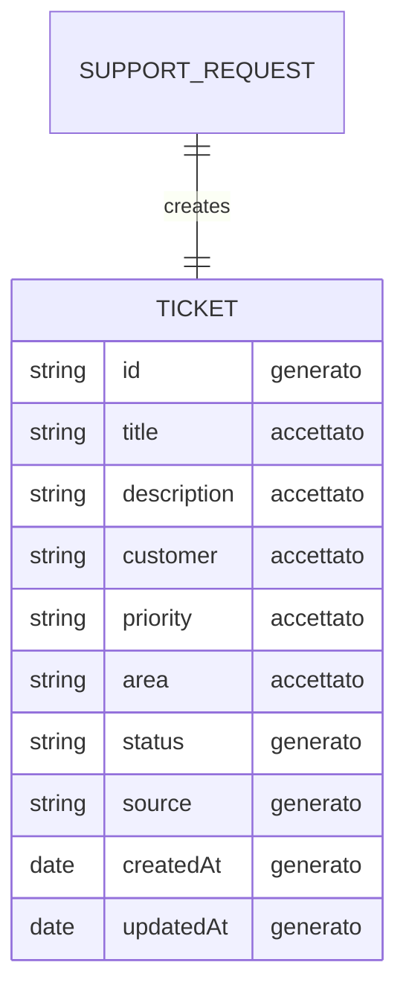

# Contract Plan — Create Ticket (L06)

Basato su: `template/contract-sketch-create-ticket.md`, `template/data-sketch-create-ticket.md`, `l05-create-ticket-issue/create-ticket-issue-final.md`

---

## 1. Scope

**Request**: Serve creare ticket dal supporto.

**Action**: Generare tramite un form un payload di dati coerente con la issue da inviare al server e ricevere una risposta in caso di errore o successo dell'operazione.

---

## 2. Boundary Map

| Superficie | Cosa riguarda |
|---|---|
| UI | L'utente ha accesso a un form che gli permette di inviare un nuovo ticket |
| API / azione | Viene inviato al server un payload contenente `title` (obbligatorio), `description` (opzionale), `customer` (opzionale), `priority` (opzionale), `area` (opzionale) |
| Dati | title (string, accettato), description (string, accettato), customer (string, accettato), priority (string, accettato), area (string, accettato), id (string, generato), status (string, generato), source (string, generato), createdAt (date, generato), updatedAt (date, generato) |
| Verifica | I dati che non passano la validazione ricevono un errore. In caso di errore dal server, riceviamo un errore in risposta dall'API esposta |

---

## 3. Data Sketch — Campi Classificati

| Campo | Stato | Tipo | Motivo | Fonte |
|---|---|---|---|---|
| `title` | accettato | string | Valore minimo per identificare la richiesta. Obbligatorio. Vincoli: max 100 caratteri dopo trimming, non vuoto, non soli spazi | issue |
| `description` | accettato | string | Campo opzionale per descrizione dettagliata del ticket. Vincoli: opzionale (può essere vuoto), max 3000 caratteri | issue / app |
| `customer` | accettato | string | Nome del cliente che segnala il problema. Opzionale in fase di creazione | app (seed data) |
| `priority` | accettato | string | Livello di urgenza del ticket. Opzionale in fase di creazione. Valori ammessi: "Alta", "Media", "Bassa" | app (seed data) |
| `area` | accettato | string | Area funzionale di competenza. Opzionale in fase di creazione. Valori ammessi: "Billing", "Accessi", "Comunicazioni", "Tecnico" | app (seed data) |
| `status` | generato | string | Alla creazione il ticket riceve status "open" automaticamente | decisione |
| `source` | generato | string | Alla creazione il ticket riceve source "support" automaticamente | app (seed data) |
| `id` | generato | string | L'id viene generato dal database. Formato: "TCK-XXXX" | app (seed data) |
| `createdAt` | generato | date | Data di creazione generata dal server | issue |
| `updatedAt` | generato | date | Data di ultima modifica aggiornata automaticamente dal server | app (seed data) |

**Totale: 10 campi classificati** (5 accettati, 5 generati).

---

## 4. Relazioni — Mermaid



Mostra solo campi con stato `accettato` o `generato`.

---

## 5. Payload

### 5.1 Payload Valido

```json
{
  title: "Richiesta nuovo accesso",
  description: "Il cliente richiede l'abilitazione di un nuovo operatore",
  customer: "Boolean Support",
  priority: "Media",
  area: "Accessi"
}
```

**Perché è valido:** Contiene `title` obbligatorio più tutti i campi opzionali previsti dal modello.

**Risposta attesa — successo:**

```json
{
  id: "TCK-1055",
  title: "Richiesta nuovo accesso",
  description: "Il cliente richiede l'abilitazione di un nuovo operatore",
  customer: "Boolean Support",
  priority: "Media",
  area: "Accessi",
  status: "open",
  source: "support",
  createdAt: "2026-06-27T10:00:00.000Z",
  updatedAt: "2026-06-27T10:00:00.000Z"
}
```

**Messaggio:** `"Ticket creato con successo."`

### 5.2 Payload Invalido 1 — title vuoto

```json
{
  title: "",
  description: "Richiesta di abilitazione operatore",
  customer: "Boolean Support",
  priority: "Media",
  area: "Accessi"
}
```

**Motivo del rifiuto:** Il campo "title" è vuoto o contiene soltanto spazi.

**Risposta attesa:**

```json
{
  error: "400 VALIDATION_ERROR",
  message: "title is required",
}
```

### 5.3 Payload Invalido 2 — title troppo lungo

```json
{
  title: "Questo titolo contiene più di cento caratteri. è un titolo davvero lungo, non dovrebbe essere accettato, mi chiedo come sia possibile che abbia passato la validazione, è così lungo che non riesco a visualizzarlo per intero!",
  description: "Richiesta di abilitazione operatore",
  customer: "Boolean Support",
  priority: "Media",
  area: "Accessi"
}
```

**Motivo del rifiuto:** Il campo "title" supera i 100 caratteri.

**Risposta attesa:**

```json
{
  error: "400 VALIDATION_ERROR",
  message: "The field title too long. Max 100 characters accepted",
}
```

---

## 6. Error Model Minimo

| Caso | Motivo | Risposta attesa |
|---|---|---|
| Campo richiesto mancante o vuoto | il campo è required e non opzionale per la creazione del ticket | `[field] is required` |
| Valore fuori contratto | il campo non rispetta i limiti richiesti | `The [field] too long. Max [value] characters accepted` |

---

## 7. Non-Goals Confermati (da L05)

- Attachments
- Auth, referral, reporter
- Non generare codice, schema del database, migrazioni, UI, test automatici, rotte API, PR
- Owner (rimandato a slice futuri)

---

## 8. Deliverable Check

- ✅ 1 payload valido con tutti i campi del modello (sezione 5.1)
- ✅ 2 payload invalidi (sezioni 5.2, 5.3)
- ✅ Ogni payload ha risposta attesa
- ✅ Ogni errore ha motivo leggibile
- ✅ 10 campi classificati (5 accettati, 5 generati, sezione 3)
- ✅ Ogni campo ha stato, motivo e fonte
- ✅ Mermaid mostra tutti i campi accettati e generati
- ✅ Non-goals della issue L05 rispettati
- ✅ Modello dati allineato con i seed data dell'app

---

## 9. Cosa Cercare In L07 (Prossimo Slice)

| Cosa | Dove cercare |
|---|---|
| Implementazione modello Ticket | Cercare file del model nell'app (es. `models/ticket.js` o equivalente) |
| Naming convention `title`, `description` | Verificare coerenza in model, controller, route |
| Validazione title: 100 caratteri, trimming, non vuoto | Cercare logica di validazione nel controller o in un validator |
| Validazione description: 3000 caratteri, opzionale | Cercare logica di validazione nel controller o in un validator |
| Validazione customer: opzionale, string | Cercare logica di validazione |
| Validazione priority: valori ammessi ["Alta","Media","Bassa"] | Valori ammessi regolati dalla logica validazione |
| Validazione area: valori ammessi ["Billing","Accessi","Comunicazioni","Tecnico"] |Valori ammessi regolati dalla logica validazione |
| Endpoint POST esposto dal server | Route in `server/index.js:26` |
| Gestione errore 400 | Error handler per validazione fallita |
| Campo `status` generato | Assegnare "open" di default |
| Campo `source` generato | Assegnare "support" di default |
| Campo `createdAt` e `updatedAt` | Generare dal server (es. `new Date().toISOString()`) |
| Campo `id` generato | Generare formato "TCK-XXXX" (auto-increment su array) |

---

## 10. Allineamento con modello dati dell'app

| Disallineamento | Risoluzione |
|---|---|
| `content` → `description` | Rinominato in tutto il documento |
| `id` tipo `integer/uuid` → `string` | Formato "TCK-XXXX" come nei seed data |
| Campi mancanti `customer`, `priority`, `area`, `source` | Aggiunti come accettati/generati |
| `priority` e `area` rimossi dai non-goals | Ora presenti nel modello con valori ammessi |
