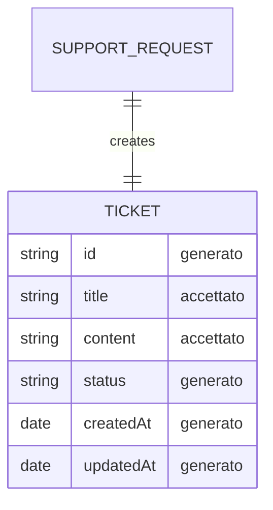

# Contract Plan — Create Ticket (L06)

Basato su: `template/contract-sketch-create-ticket.md`, `template/data-sketch-create-ticket.md`, `l05-create-ticket-issue/create-ticket-issue-final.md`

---

## 1. Scope

**Request**: Serve creare ticket dal supporto.

**Action**: Generare tramite un form un payload di dati coerente con la issue da inviare al server e ricevere una risposta in caso di errore o successo dell'operazione.

---

## 2. Boundary Map

| Superficie | Cosa riguarda |
|---|---|
| UI | L'utente ha accesso a un form che gli permette di inviare un nuovo ticket |
| API / azione | Viene inviato al server un payload contenente `title` (obbligatorio) e `content` (opzionale) |
| Dati | title (string, accettato), content (string, accettato), status (string, generato), id (integer/uuid, generato), createdAt (date, generato), updatedAt (date, generato) |
| Verifica | I dati che non passano la validazione ricevono un errore. In caso di errore dal server, riceviamo un errore in risposta dall'API esposta |

---

## 3. Data Sketch — Campi Classificati

| Campo | Stato | Tipo | Motivo | Fonte |
|---|---|---|---|---|
| `title` | accettato | string | Valore minimo per identificare la richiesta. Obbligatorio. Vincoli: max 100 caratteri dopo trimming, non vuoto, non soli spazi | issue |
| `content` | accettato | string | Campo opzionale per descrizione dettagliata del ticket. Vincoli: opzionale (può essere vuoto), max 3000 caratteri | decisione |
| `priority` | mancante | — | Attualmente fuori scope in questo slice | decisione |
| `area` | mancante | — | Attualmente fuori scope in questo slice | decisione |
| `status` | generato | string | Alla creazione il ticket riceve status "open" automaticamente. Non inviato dall'utente ma presente nel modello restituito | decisione |
| `id` | generato | integer / uuid | L'id viene generato dal database al momento dell'inserimento | issue |
| `attachments` | respinto | — | La presenza di allegati verrà valutata in fasi successive | decisione |
| `owner` | mancante | — | Attualmente fuori scope in questo slice | decisione |
| `createdAt` | generato | date | Data di creazione generata dal server. Inclusa nel modello ma non esposta nella UI | issue |
| `updatedAt` | generato | date | Data di ultima modifica aggiornata automaticamente dal server. Sarà utile per gli slice di edit/delete futuri | inferenza |

**Totale: 10 campi classificati** (2 accettati, 5 generati, 3 mancanti, 1 respinto).

---

## 4. Relazioni — Mermaid



Mostra solo campi con stato `accettato` o `generato`. Campi `mancanti` e `respinti` sono esclusi dal diagramma.

> **Nota sul tipo di `id`**: nella tabella è indicato come `integer / uuid`. La scelta dipende dal server: auto-increment (integer) o UUID. Il Mermaid usa `string` come tipo generico; la tabella Campi è l'unica fonte di verità per il tipo esatto.

---

## 5. Payload

### 5.1 Payload Valido

```json
{
  title: "il titolo del ticket",
  content: "la descrizione della richiesta del ticket",
}
```

**Perché è valido**: Contiene i dati minimi richiesti (`title` obbligatorio, `content` opzionale).

**Risposta attesa — successo:**

```json
{
  id: // l'id generato dal server
  title: "il titolo del ticket",
  content: "la descrizione della richiesta del ticket",
  status: "open"
  createdAt: // la data di creazione viene generata dal server
}
```

**Messaggio:** `"Ticket creato con successo."`

### 5.2 Payload Invalido 1 — title vuoto

```json
{
  title: "",
  content: "la descrizione della richiesta del ticket",
}
```

**Motivo del rifiuto:** Il campo "title" è vuoto o contiene soltanto spazi.

**Risposta attesa:**

```json
{
  error: "400 VALIDATION_ERROR",
  message: "title is required",
}
```

### 5.3 Payload Invalido 2 — title troppo lungo

```json
{
  title: "Questo titolo contiene più di cento caratteri. è un titolo davvero lungo, non dovrebbe essere accettato, mi chiedo come sia possibile che abbia passato la validazione, è così lungo che non riesco a visualizzarlo per intero!",
  content: "la descrizione della richiesta del ticket",
}
```

**Motivo del rifiuto:** Il campo "title" supera i 100 caratteri.

**Risposta attesa:**

```json
{
  error: "400 VALIDATION_ERROR",
  message: "The field title too long. Max 100 characters accepted",
}
```

---

## 6. Error Model Minimo

| Caso | Motivo | Risposta attesa |
|---|---|---|
| Campo richiesto mancante o vuoto | il campo è required e non opzionale per la creazione del ticket | `[field] is required` |
| Valore fuori contratto | il campo non rispetta i limiti richiesti | `The [field] too long. Max [value] characters accepted` |

---

## 7. Non-Goals Confermati (da L05)

- Attachments
- Auth, referral, reporter
- Non generare codice, schema del database, migrazioni, UI, test automatici, rotte API, PR
- Owner, priority, area (rimandati a slice futuri)

---

## 8. Deliverable Check

- ✅ 1 payload valido (sezione 5.1)
- ✅ 2 payload invalidi (sezioni 5.2, 5.3)
- ✅ Ogni payload ha risposta attesa
- ✅ Ogni errore ha motivo leggibile
- ✅ Almeno 5 campi classificati (10 totali, sezione 3)
- ✅ Ogni campo ha stato, motivo e fonte
- ✅ Mermaid mostra solo relazioni minime e campi motivati
- ✅ Non-goals della issue L05 rispettati

---

## 9. Cosa Cercare In L07 (Prossimo Slice)

| Cosa | Dove cercare |
|---|---|
| Implementazione modello Ticket | Cercare file del model nell'app (es. `models/ticket.js` o equivalente) |
| Naming convention del campo `title` | Verificare che il nome `title` sia coerente in model, controller, route |
| Naming convention del campo `content` | Verificare che il nome `content` sia coerente in model, controller, route |
| Validazione title: 100 caratteri, trimming, non vuoto | Cercare logica di validazione nel controller o in un validator |
| Validazione content: 3000 caratteri, opzionale | Cercare logica di validazione nel controller o in un validator |
| Endpoint POST esposto dal server | Cercare route file che espone la creazione del ticket |
| Gestione errore 400 | Cercare error handler per validazione fallita |
| Campo `status` generato | Verificare che il model assegni "open" di default |
| Campo `createdAt` e `updatedAt` | Verificare che il model o DB li gestisca automaticamente (es. timestamps) |
| Campo `id` generato dal DB | Verificare auto-increment o UUID nella configurazione del model |
